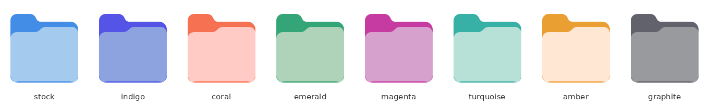

# More Accent Colors

A GNOME Shell 50 extension that adds accent colors beyond the nine GNOME ships
with, plus an arbitrary color picker. Recolors GNOME Shell, libadwaita/GTK apps,
and folder icons.



<p align="center"><sub>Stock Adwaita on the left, then the same icon recolored through the OKLCh pipeline.</sub></p>


---

## Why an extension is needed

`org.gnome.desktop.interface accent-color` is a GSettings **enum**, locked to
`blue teal green yellow orange red pink purple slate`. `St.Settings:accent-color`
is read-only, and `St.SystemAccentColor` is a fixed enum of the same nine. There
is no supported way to add a tenth value, so the color has to be injected at the
stylesheet level instead.

## Colors added

`indigo` `violet` `lavender` `magenta` `rose` `maroon` `brown` `olive` `lime`
`emerald` `mint` `turquoise` `cyan` `amber` `gold` `graphite` `coral`

Plus a custom color picker, and the original nine so you can pin one regardless
of the system setting.

## Install

```sh
git clone https://github.com/RobbyBobby77/gnome-more-accent-colors.git
cd gnome-more-accent-colors
make install
```

Then log out and back in. This is required **once**, because GNOME Shell only
scans for new extensions at startup and Wayland cannot reload the Shell in place.
After that:

```sh
gnome-extensions enable more-accent-colors@robbybobby77.github.io
gnome-extensions prefs  more-accent-colors@robbybobby77.github.io
```

In the preferences window, turn on **Override the system accent color** first —
the extension deliberately does nothing until you ask it to, so the palettes stay
greyed out until then.

### Updating

```sh
make install
```

Then **log out and back in**. GNOME Shell caches extension code as an ES module
for the life of the process, so `disable`/`enable` re-runs `enable()` on the
*old* code — it does not re-read the files. On Wayland the Shell cannot restart
in place, so a new login is the only way to load changed code.

Changing colors, on the other hand, is fully live and never needs a logout.

### Uninstall

```sh
gnome-extensions disable more-accent-colors@robbybobby77.github.io   # reverts everything
make uninstall
```

Disabling restores the stock accent: the generated stylesheet is unloaded and
deleted, the GTK import line is stripped, and the generated icons are removed.

## How it works

### GNOME Shell

GNOME 50's stylesheet never hardcodes the accent. It emits two keywords that St
resolves at runtime, usually wrapped in St's own color functions:

```css
background-color: st-mix(-st-accent-color, st-darken(#fafafb, 7%), 5%);
```

St already evaluates those functions over literal colors — the shipped CSS is
full of `st-mix(#222226, #fafafb, 12%)` — so the extension:

1. reads the Shell's *current* stylesheet through `St.Theme.get_default_stylesheet()`
   (and the user theme, if one is set),
2. keeps only the declarations mentioning an accent keyword (139 rules out of
   3,325 lines),
3. swaps the keywords for literal colors, leaving the surrounding functions alone,
4. loads the result back via `St.Theme.load_stylesheet()`.

Because the color functions are left intact, every derived shade — hover, active,
focus rings, transparentized variants — falls out for free. Nothing is pinned to
a particular Shell release: if the theme changes, the extension re-derives from
whatever is actually installed.

It regenerates on light/dark switches, high-contrast toggles, and whenever the
`StTheme` object is replaced (a user theme loading, for instance).

### GTK and libadwaita apps

Overrides are written to `~/.config/gtk-4.0/more-accent-colors.css` and pulled in
with a single marked `@import` line at the top of `gtk.css`. Anything already in
your `gtk.css` is preserved, and disabling the extension removes only that line.

The values follow libadwaita 1.9 exactly, including its standalone-accent formula
for links and selected text:

```css
@define-color accent_color oklab(from #4f46e5 min(l, 0.5) a b);   /* max(l, 0.85) when dark */
```

Both the modern custom properties (`--accent-bg-color`) and the `@define-color`
compatibility aliases are set. GTK reloads `gtk.css` live, so most apps recolor
without restarting.

Foreground selection matches libadwaita too: it hardcodes white for all nine of
its accents, the lightest being yellow at OKLab L=0.674, so this uses white up to
L=0.70 and dark text above it. All nine system colors come out identical to stock
GNOME; only genuinely bright custom picks get dark text.

### Apps that don't follow the CSS

Two kinds of app never see the generated stylesheet, and no amount of CSS will
reach them:

**Apps that read the accent programmatically.** Anything calling
`adw_style_manager_get_accent_color()`, or reading the
`org.freedesktop.appearance` `accent-color` portal key, resolves from the
GSettings enum rather than from CSS. Those APIs can only ever return one of the
nine, so a tenth color is invisible to them.

**Flatpak apps.** They are sandboxed and cannot read `~/.config/gtk-4.0/gtk.css`
at all unless granted access:

```sh
flatpak override --user --filesystem=xdg-config/gtk-4.0:ro
```

That grants read-only access to just that directory. Without it, Flatpak apps
fall back to the portal — so they land on the same enum as the first group.

Because both paths bottom out at the same nine-value enum, `sync-system-accent`
(on by default) points `org.gnome.desktop.interface accent-color` at whichever
built-in accent is closest to your choice, measured by Euclidean distance in
OKLab. Pick crimson and those apps get GNOME's red rather than an unrelated
color. The original value is saved and restored when the extension is disabled.

It is an approximation by construction: apps using the CSS get your exact color,
apps using the enum get the nearest of nine. Turn it off if you would rather they
stay on your original system accent.

### Folder icons

Folder icons aren't styleable — Adwaita draws them as SVGs with a hardcoded blue
palette (`#438de6` back, a `#62a0ea` gradient, `#a4caee` front face), so the only
way to tint them is to generate recolored copies.

The recolor is an OKLCh delta from GNOME's blue (`#3584e4`): hue and chroma move
to the target accent, and each color's lightness shifts by the same amount the
accent did. Keeping the lightness *relationships* intact is what preserves the
folder's shading — the front face stays lighter than the back tab. Colors that
fall outside sRGB have their chroma walked down until they fit, so the hue stays
correct instead of a channel clipping and skewing it.

Recoloring with the reference accent is byte-identical to the stock icon, which
is the invariant the tests pin down.

The copies go into `~/.local/share/icons/<theme>/`, which shadows the system
theme of the same name at every size — 16px included — **without touching your
`icon-theme` setting**. That was deliberate: if this extension is ever
force-removed, the icons simply revert. Pointing `icon-theme` at a generated
theme would instead leave a dangling setting and broken icons.

15 icons are recolored: `folder`, `inode-directory`, `folder-open`, the eight
special folders (documents, download, music, pictures, publicshare, remote,
templates, videos), `folder-drag-accept`, `user-home`, `user-desktop`, and
`user-bookmarks`. An SVG qualifies by using at least three colors from the base
palette, which is derived at runtime from `folder.svg` rather than hardcoded.
Across all 715 SVGs in Adwaita that rule selects exactly those 15, with no false
positives — it excludes `network-workgroup.svg`, which coincidentally shares one
blue. Non-palette colors are left alone, so the grey network glyph on
`folder-remote` survives.

Every context directory under `scalable/` is scanned rather than a fixed list.
This matters: a plain directory resolves to **`inode-directory`** before
`folder`, and that icon lives in `mimetypes/`, not `places/`. Hardcoding contexts
recolored the special folders while leaving every ordinary folder blue. Scanning
all of them costs about 7 ms.

Icons you have already placed in your own icon directory are never overwritten,
and never deleted on cleanup.

**Limitation:** this only works for Adwaita and themes that inherit it. If you
use a theme with its own folder icons (Papirus, say), that theme wins and folders
keep its color; the extension logs a warning and changes nothing.

## Settings

| Key | Default | Meaning |
| --- | --- | --- |
| `accent-color` | `system` | Palette id, `custom`, or `system` to not interfere |
| `custom-color` | `#4f46e5` | Used when `accent-color` is `custom` |
| `apply-to-shell` | `true` | Recolor GNOME Shell |
| `apply-to-gtk4` | `true` | Recolor libadwaita/GTK4 apps |
| `apply-to-gtk3` | `false` | Recolor GTK3 apps |
| `apply-to-folders` | `true` | Recolor folder icons |
| `sync-system-accent` | `true` | Point the system accent enum at the nearest built-in |
| `force-important` | `true` | Mark generated Shell rules `!important` |

`force-important` guarantees the overrides beat the base theme regardless of
stylesheet cascade order. Turn it off if it fights another theming extension.

## Tests

```sh
make test
```

Plain `gjs`, no framework. The suite runs against a throwaway `XDG_*` root, so it
can never touch your real `gtk.css`, icons, or settings — the filesystem suites
refuse to start if the sandbox isn't set.

```text
colors     52 passed     parsing, color math, system-accent restoration
cssgen     36 passed     extraction, substitution, at-rules, real Shell stylesheet
gtkexport  23 passed     config writing, ownership, user-content preservation
folders    28 passed     icon selection, recoloring, theme safety, cleanup
```

The assertions worth knowing about:

- **Foreground rule matches libadwaita.** All nine GNOME accents must resolve to
  white text, since libadwaita hardcodes `accent_fg_color: white`.
- **Identity invariant.** Recoloring folder icons to the reference accent
  reproduces the stock Adwaita icon byte-for-byte.
- **Gamut clipping never merges shades.** The recolored icon keeps five distinct
  colors, so the folder's shading can't flatten — checked including pure white
  and pure black accents.
- **User content is never destroyed.** Pre-existing `gtk.css` rules and
  user-placed icon overrides survive both apply and cleanup.
- **Extraction stays sound against the installed Shell stylesheet**, for light,
  dark, and high-contrast: braces balanced, no keyword left unresolved.

## Layout

```text
more-accent-colors@robbybobby77.github.io/
  extension.js        apply/revert, signal wiring
  prefs.js            Adw preferences with swatch grid
  lib/colors.js       palette + OKLab/OKLCh math (shared; no Shell/Gtk imports)
  lib/cssgen.js       stylesheet extraction and keyword substitution
  lib/gtkexport.js    GTK/libadwaita config writing
  lib/folders.js      folder icon recoloring and icon-theme shadowing
  schemas/            GSettings schema
tests/                gjs test suite, sandboxed via XDG_*
```

`lib/colors.js` is imported by both `extension.js` and `prefs.js`, so it stays
free of any Shell-only or Gtk-only imports.

## Requirements

GNOME Shell 50, libadwaita 1.9+ for the GTK4 path (the `oklab()` relative-color
syntax used for the standalone accent needs a recent GTK).

## License

[GPL-3.0-or-later](LICENSE)
